# BookStream

BookStream is a comprehensive book management application for organizing and managing your book collection efficiently.

## Table of Contents

- [BookStream](#bookstream)
  - [Table of Contents](#table-of-contents)
  - [Description and globales features](#description-and-globales-features)
    - [Global Features](#global-features)
  - [Screenshots](#screenshots)
    - [Home Screen](#home-screen)
    - [Book Details](#book-details)
    - [Edit Book](#edit-book)
    - [Add Book](#add-book)
    - [Statistics](#statistics)
    - [Settings](#settings)
  - [Technologies used](#technologies-used)

## Description and globales features
BookStream is a comprehensive book management application designed to help you organize and manage your book collection efficiently. It integrates with the Open Library API to fetch detailed information about books and provides a user-friendly interface for a seamless experience.

### Global Features

- **Manage Personal Book Collection**: Add, edit, and delete books from your personal collection.
- **Fetch Book Details**: Retrieve detailed book information, including title, author, publication date, and cover image, from the Open Library API.
- **User-Friendly Interface**: Intuitive and easy-to-use interface designed with user experience in mind.
- **Cross-Platform**: Built with React Native and Expo, ensuring compatibility across both iOS and Android devices.
- **Internationalization**: Available in multiple languages, including French, English, and German.
- **Statistics**: View statistics about your book collection.
- **Settings**: Customize the app settings to suit your preferences.

## Screenshots

Here are some screenshots of the application:

### Home Screen

The Home Screen displays a preview of each book in the collection.

Users can sort the books by various options such as Title, Author, Publication Date, Date of Addition, and Rating. The selected sorting option is saved for future use. Additionally, users can filter the books to display only those they are interested in. The available filters include Book Status, Rating, Author, Publisher, Series, Reading Year, and Language.  
<table>
  <tr>
    <td>Home page</td>
     <td>Sorting options</td>
     <td>Filter options</td>
  </tr>
  <tr>
    <td>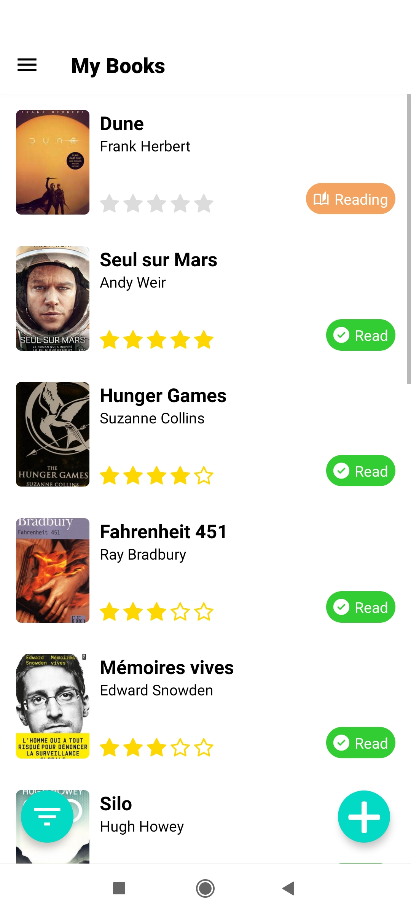</td>
    <td>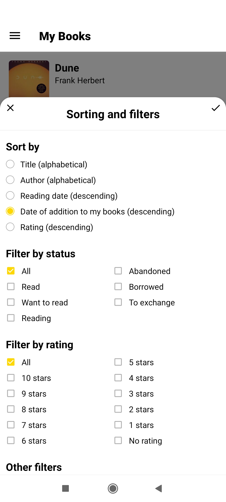</td>
    <td>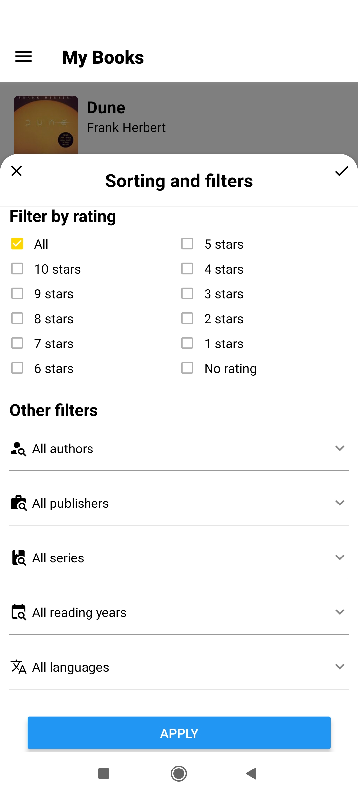</td>
  </tr>
 </table>

### Book Details

The Book Details screen displays comprehensive information about the book, including:

- Title
- Author
- Series and volume number
- Publisher
- Publication date
- ISBN
- Number of pages
- Language
- Categories

Additionally, the screen allows users to manage book. Users can:

- Rate the book
- Select the status of the book (e.g., reading, Read, Want to read, Abandoned, Borrowed, To exchange)
- Enter the start and end dates of reading
- Add comments
- Delete the book from their library

<table>
  <tr>
    <td>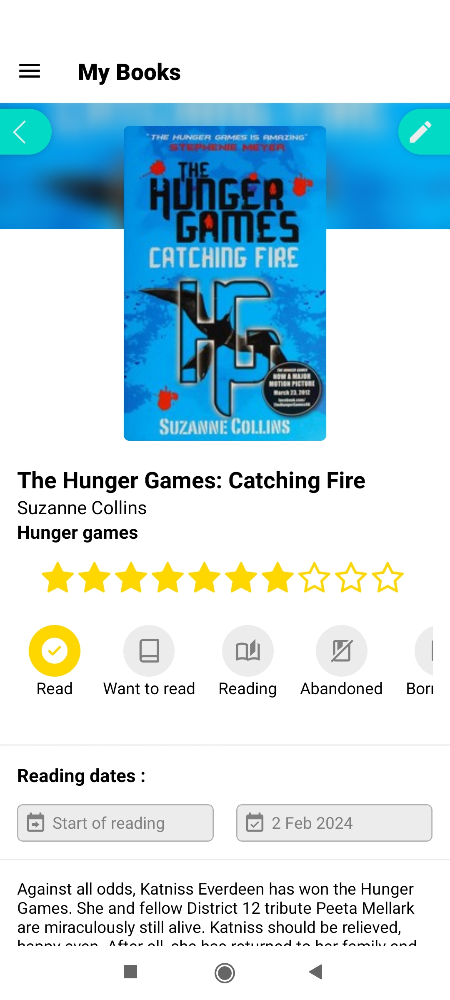</td>
    <td>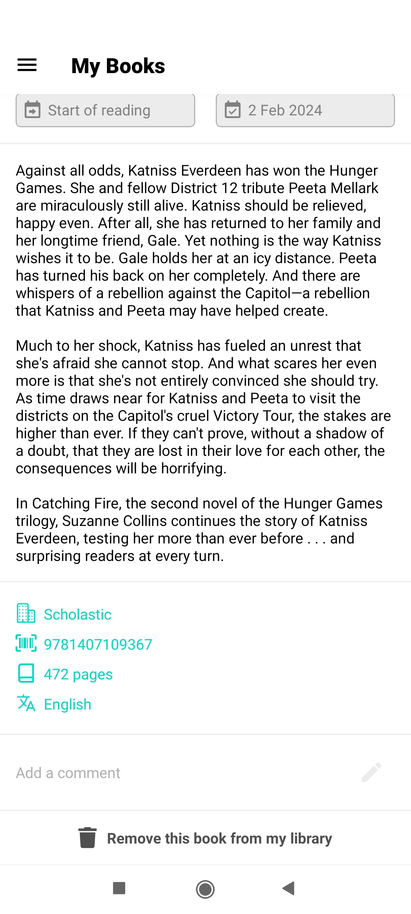</td>
  </tr>
</table>

### Edit Book

Users can modify the information of each book, including changing the cover image by either taking a photo or selecting one from their gallery. To assist users, suggestions are displayed under the text input fields based on the data saved in the database. 
<table>
  <tr>
    <td>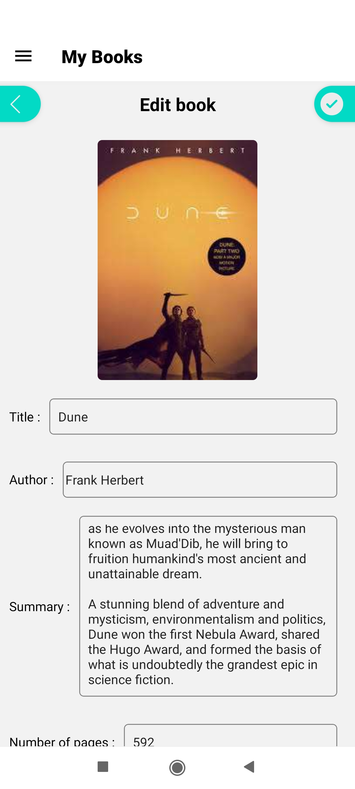</td>
    <td>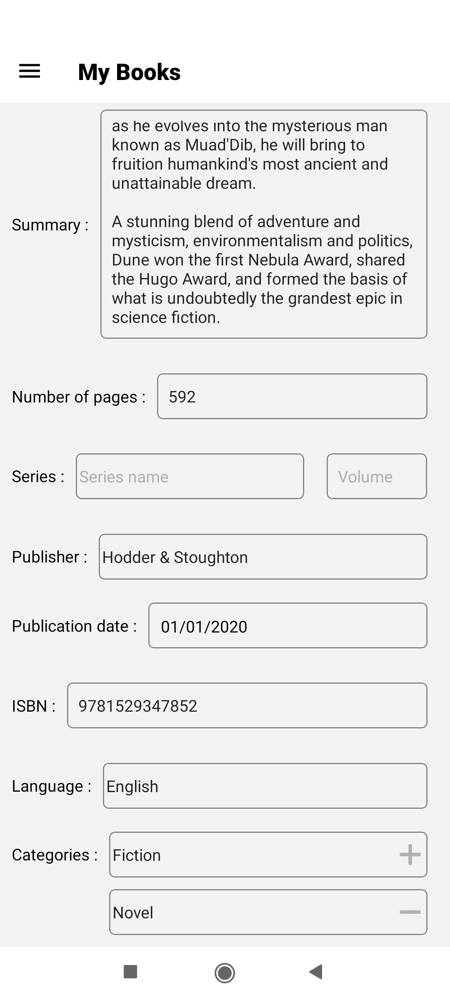</td>
  </tr>
  <tr>
    <td>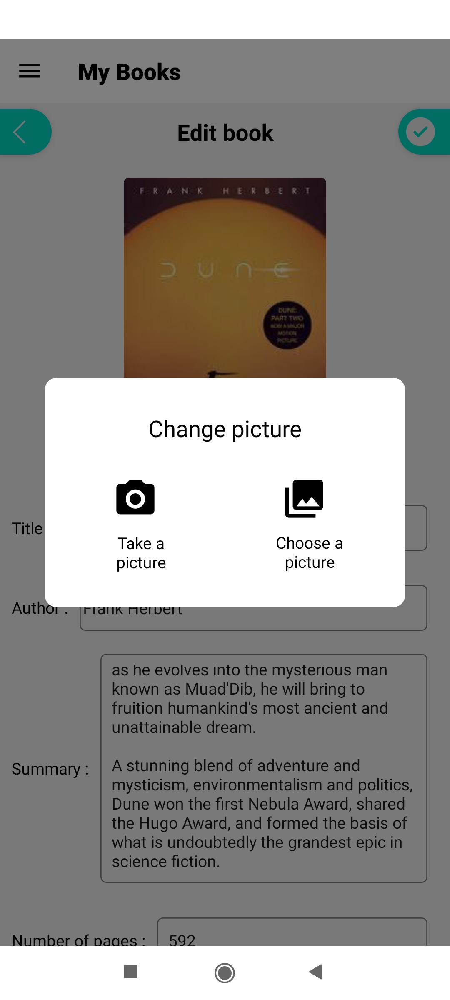</td>
    <td>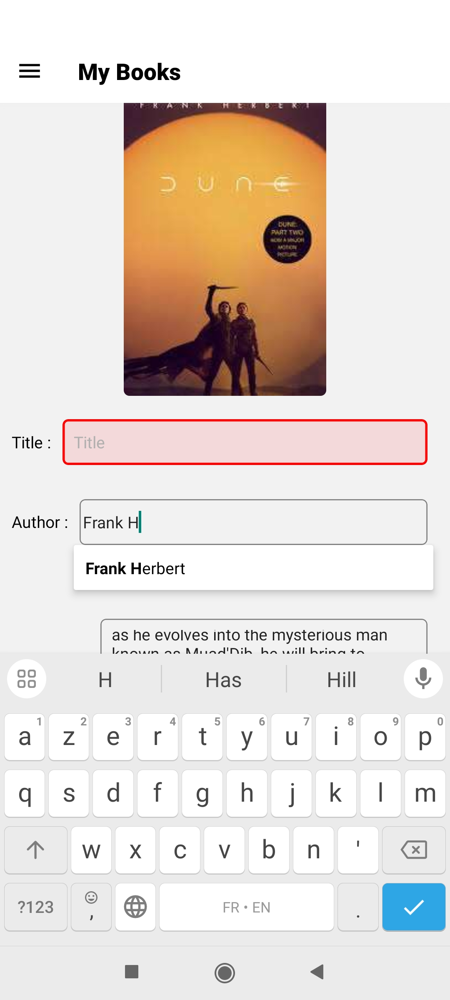</td>
  </tr>
</table>

### Add Book
The user can add a book by several wxays : by isbn search, by keyword (title author publisher ... ) or by scanning the isbn directly on the book.
The app uses the Open Library API to fetche the book infos corresponding of the search query.

<table>
  <tr>
    <td>Add screen</td>
    <td>Search by keyword and advanced search screen</td>
  </tr>
  <tr>
    <td>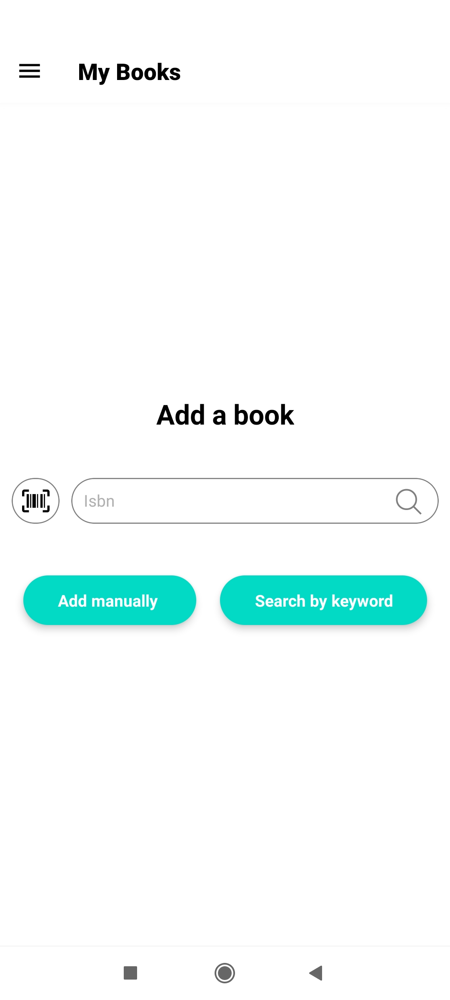</td>
    <td>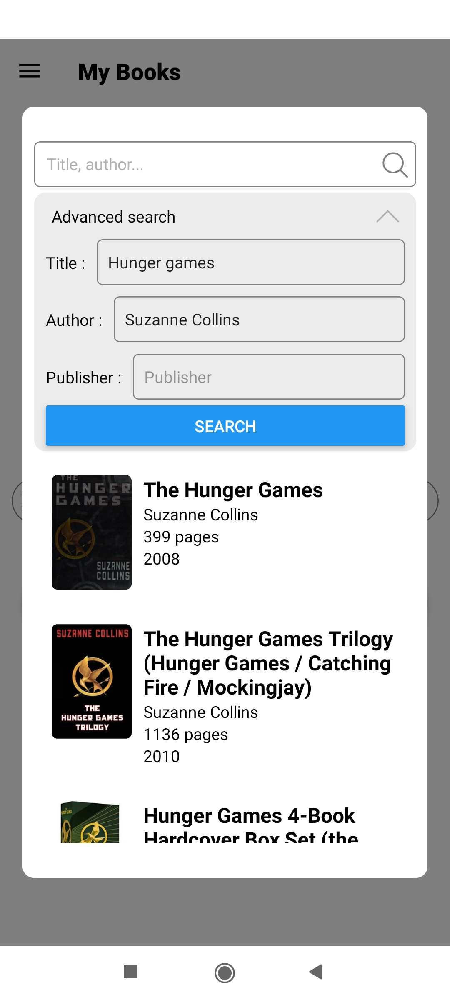</td>
  </tr>
</table>

### Statistics

The Statistics screen provides users with insightful data about their book collection. Some statistics can be displayed for a chosen year or for all years. Key features include:

- **Total Books**: Displays the total number of books read.
- **Total Pages**: Shows the total number of pages read.
- **Average Reading Time**: Calculates the average reading time per book.
- **Reading Progress**: Tracks the number of books read over time, allowing users to see their reading trends.
- **Top Rated Books**: Highlights the books with the highest ratings.
- **Books by Status**: Shows the distribution of books based on their status (e.g.,  reading, Read, Want to read, Abandoned).
- **Top 10 Authors**: Lists the most read authors in the collection, helping users see their reading preferences.

These statistics help users gain a deeper understanding of their reading habits and preferences.

<table>
  <tr>
    <td>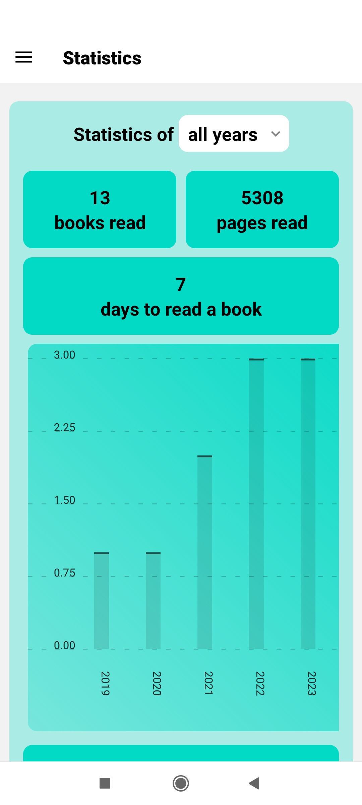</td>
    <td>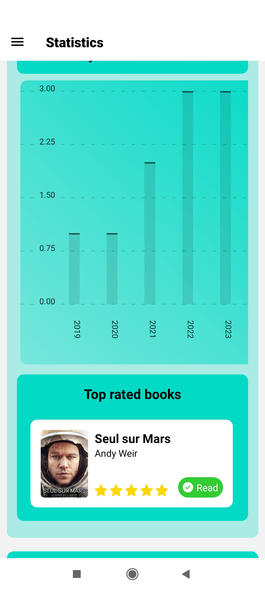</td>
    <td>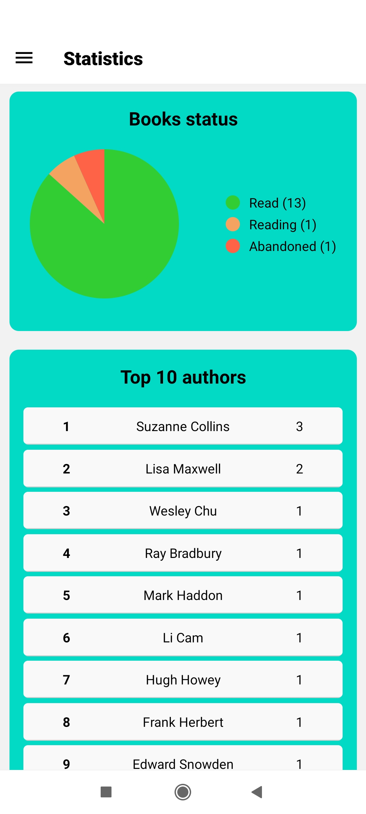</td>

  </tr>
</table>

### Settings

The Settings screen allows users to customize their app experience. Key features include:

- **Language Selection**: Available in three languages: French, English, and German.
- **Default Book Status**: Choose the default status for newly added books (e.g., reading, Read, Want to read, Abandoned).
- **Library Management**: Option to delete the entire library.

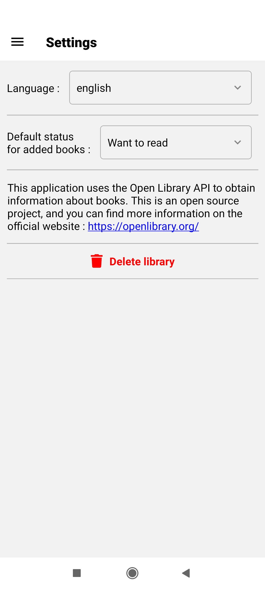

## Technologies used
- React Native
- Expo
- i18n (for internationalization)
- JavaScript
